# Yalma
(**Y**et **A**nother **L**uxmed **M**onitoring **A**pp)

* [What this is about?](#what-this-is-about)
* [Installation](#installation)
* [Usage](#usage)
* [TODO](#todo)

## What this is about?
Yalma is an application that allows monitoring visits availability in Luxmed for helping you to take care of your health. 
If any visits that fulfill your criteria become available, Yalma will notify you about that by email. 
Currently, the app supports to monitor availability considering the city, service, clinic, time of day and date range 
which you are interested in, but in the future, you will be able to choose a doctor as well.

[]()

## Installation
1. Install required dependencies by `pip install -r requirements.txt`
1. Before you run the app, please create a `config.ini` file at path (this is a manual procedure for now):
    * `$HOME/.config/yalma/` if you are using GNU/Linux or Mac;
    * `C:\Users\your_username\AppData\Local\yalma\` if you are on Windows.

    Here is a template of that `config.ini` file:

    ```ini
    [luxmed]
    username = 
    password = 
    language = en
    
    [email_settings]
    username = 
    password = 
    smtp_server = 
    smtp_port = 
    ```

    ##### Luxmed section
    * you have to provide your `username` and `password` there;
    * `language` position has 2 possible values: `en` or `pl` - this setting has not any influence on returned data 
    (like specialization names) from the Luxmed system - it only defines the language of errors you can receive 
    from that API. 
     
    ##### Email settings section
    These are settings for sending email to you when any visits are available. Your `username` is an email address
    from which the email will be sent as a notification about newly available visits.
    * `username` and `password` is pretty obvious ;)
    * SMTP server and port depend on your mail server. For instance, for Gmail it will be `smtp.gmail.com` and `465` 
    as a port.
 
## Usage
 First of all, just run the app by the `python yalma.py` command. To start to monitor available visits, you have to know 
 in which city you are going to monitor visits and decide what the service will be. The service is a consultation 
 with a doctor or an examination. Those data are represented by IDs. So let's get them! Let's start by getting
 your city ID:
 
 ```shell script
 python yalma.py cities
```
 Yalma will return identifiers for all cities where Luxmed has its clinics. Now you have to choose a service which
 you are interested in:
 
```shell script
python yalma services --city-id your_city_id
```
 
 Now you can start to monitor visits for your criteria. To check how to do that, you can use a `--help` option on the 
 `monitor` command:
 
```shell script
python yalma.py monitor --help
```
 
 Keep in mind that Yalma doesn't have any scheduling mechanism implemented, so in order to check the visits availability
 every - for instance - 15 minutes, you can add above mentioned `monitor` command with required parameters 
 to your crontab to let Cron do its job ;) For example:
 
 ```shell script
*/15 * * * * /usr/bin/python /home/your_user_name/yalma.py monitor --email your@mail.com --city-id 1 --service-id 13410 --to-date 2020-11-30
```
 
 Once visits will be available, you will get an email notification with a short report which contains a number 
 of available visits on a particular day in each clinic in your city.
 
 It's worth to add, that Yalma supports the `--help` option in every step, so to see which commands you can run 
 in the app, you can just invoke:
 
 ```shell script
python yalma.py --help
```

 Now it's your turn - try to invoke this option on each command (`cities`, `clinics`, `services` and `monitor`) - thanks
 to that you will know every functionality in the app.
 
## TODO
1. Implement some basic configuration wizard to get rid of manual procedure for creation a config.ini in manually way ;)
2. Add support for monitoring visits availability for a given doctor.
3. Create a more user-friendly report sent by email - maybe it should be sent as HTML with well-defined sections.
4. Write the whole app like a pr0, with proper tests and using Python syntax like a pr0 - sorry, I'm a Java developer ;)